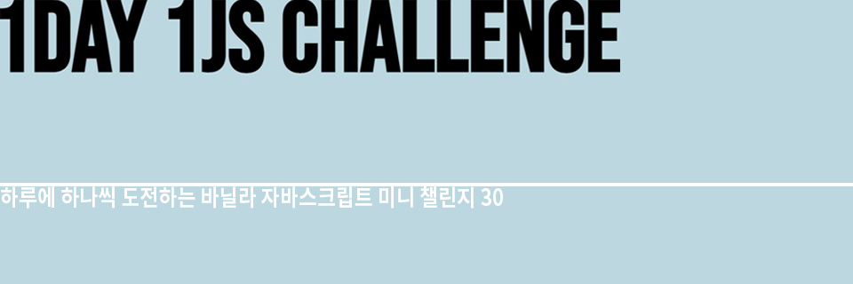

# 1Day 1JS Challenge!!

## 1. Introduction
사이트에서 제공하는 기본 템플릿을 기반으로 매일매일 Vanilla JS 챌린지 (30개)!     

배포된 사이트(https://web-doh.github.io/1day-1js/) 에서 각 챌린지마다 있는 버튼들 중
  - <b>Doh</b>를 클릭하면 내가 수정해서 만든 웹 사이트로 이동 
  - <b>Wesbos</b>를 클릭하면 사이트에서 제공하는 원본 소스의 웹 사이트로 이동

   
 

### 기간

2020/08/21 ~ 2020/10/16 (주말은 제외)

- 2020/12/17-19 : day19 파일 및 메인 페이지 추가
 

### 제작 소스 제공

Wes Bos : https://javascript30.com/
 

## 2. 사용 스킬

- ES2015+
- HTML / CSS
 

## 3. Deployment
Github: https://web-doh.github.io/1day-1js/
 

## 4. 접근 방식  
사이트에서 제시하는 솔루션을 바탕으로 직접 개선할 부분을 찾아서 개선하기  
 

## 5. 각 챌린지별 진행 방법

## Day1: Drum-kit (20/08/21)

### Function

- 키보드를 누르면 드럼 사운드 on

### Wesbos의 솔루션

1. keydown 이벤트로 눌러진 keycode와 동일한 key값을 가진 audio 실행   (add classList로 스타일도 변경)
2. forEach 문으로 transition이 끝나는 key에서 removeTransition

### 개선방향

1. transitionend 이벤트에 forEach 대신 event delegation 사용 (성능 개선)
2. playSound()로 묶여진 함수를 playSound & addTransition로 분리 (더 명확하게 인지)

---

## Day2: Clock (20/08/24)

### Function

- 아날로그 시계로 현재 시각 보여주기

### Wesbos의 솔루션

1. setInterval을 사용하여 초침,분침,시침(position-absolute)을 1초마다 rotate
   - new Date().get api를 이용하여 각도 계산

### 개선방향

1. 배경화면 랜덤 변경 함수 추가 (DOMContentLoaded, Math)
2. Styling customize: 'Calm nature' theme

---

## Day3: CSS Variables (20/08/25)

### Function

- 슬라이더를 이용해서 사이트 내 스타일 요소를 변경하는 기능

### Wesbos의 솔루션

1. HTML input 안의 name과 CSS 내 :root요소 이름 동일하게 설정
   - document.documentElement로 css 파일내 :root 요소 변경
   - HTML: input에 data-sizing 추가해서 range의 value 값에 unit 적용
2. input 요소들에 forEach 문으로 change, mousemove 이벤트 핸들

### 개선방향

1. text가 있는 사이트의 전체적인 변화를 볼 수 있도록 input 조절 요소 변경

- 제목과 본문 각각의 font-size, 본문 뒤 배경색의 opacity, base color, highlight color 변경

2. Styling customize

---

## Day4: Array Cardio-1 (20/08/26)

### Function

- array의 api 사용 능력 향상을 위한 훈련!
- filter(), map(), sort(), reduce()

---

## Day5: Flex panel gallery (20/08/27)

### Function

- Panel을 클릭하면 펼쳐지고, 다시 클릭하면 접히는 기능

### Wesbos의 솔루션

1.  forEach 문으로 click,transitionend 이벤트 추가
    - panel click -> panel open
    - panel open -> flex 관련 스타일 변경(transitionend) -> sub-text 보이는 애니메이션 효과

### 개선방향

1.  다른 panel 클릭 -> 기존에 open 되어있던 panel은 닫히도록 변경
    - filter로 열려있는 panel list 반환
    - open 돼있던 panel은 closing
2.  Styling customize: 'Sensual natural objet' theme

---

## Day6: Type ahead (20/09/03)

### Function

- 검색 창에 미국 도시의 이름을 타이핑하면, 그에 맞는 결과를 보여주는 기능

### Wesbos의 솔루션

1. fetch API로 JSON 데이터 불러오기
2. 정규식 활용
   - 인구 수: 1000단위마다 ',' 추가하여 보여주기
   - 검색어: Array.filter()과 map()을 활용하여 검색 단어와 일치하는 결과만 보여주고,검색어에는 css 강조 효과

### 개선방향

1. Styling customize: 'Earth from space' theme

---

## Day7: Array Cardio-2 (20/08/31)

### Function

- array의 api 사용 능력 향상을 위한 훈련!
- some(), every(), find(), findIndex()

---

## Day8: Fun with HTML Canvas (20/09/01)

### Function

- 웹 사이트에서 사용할 수 있는 초간단 그림판

### Wesbos의 솔루션

1. canvas API: mousedown 이벤트가 발생한 지점부터 시작해서 mousemove하는 대로 선이 그려짐
   - mouseout이나 mouseup 이벤트가 발생하면 그리기 중지    (isDrawing 변수에 boolean 값을 설정하여 제어)
2. 컬러 및 선 두께 변수 설정: 움직일 때마다 컬러의 hue와 선 두께 값 변경

### 개선방향

1. 버튼을 클릭해서, 랜덤한 위치에 랜덤한 크기의 직사각형 그리는 기능 추가
2. 그림판을 초기화 시키는 버튼을 추가하여 사용편리성 증대!
3. Styling customize: '00s mood' theme

---

## Day9: Dev tool (20/09/02)

### Function

- 개발자 도구 console 창 배우기
- log, 문자열 치환, warn, error, info, assert(testing),
  clear, dir(Viewing DOM Elements -> properties)
  grouping(groupCollapsed & groupEnd), count

---

## Day10: Hold shift & Checkbox (20/09/04)

### Function

- shift key를 누르고 체크박스 다중 선택시, 중간에 있는 체크박스들도 함께 체크

### Wesbos의 솔루션

1. checkbox 누르면, lastChecked에 어떤 checkbox인지 저장
2. check && shiftKey를 누른 상태이면, forEach 루프로 inBetween(boolean)값 변경
3. inBetween(true)인 체크 박스 모두 체크 상태로 변경

### 개선방향

1. forEach 대신 event delegation 사용 (=> 결과 : 성능이 저하됨ㅠ)
2. 맨 처음에 shiftkey 누르고 클릭하면, 클릭한 박스 밑으로 모두 체크됨
   - shift && checked 된 체크박스 index 받기 (두 개 이상이 선택된 경우에만)
   - 중간 체크박스가 checked 상태로 변경하도록 수정

---

## Day11:Custom Video Player (20/09/08 - 20/09/09)

### Function

- 비디오 플레이어 조작 기능 커스텀

### Wesbos의 솔루션

1. 비디오 재생 조작 : 재생 버튼 클릭,비디오 재생 등의 event 실행 시, 버튼아이콘 변경 
2. 비디오 재생 시간 표시 : 비디오 timeupdate event 실행 시, 비디오 기본 속성(currentTime,duration)을 활용하여 시간 표시 
3. 비디오 재생 시간 조작 : slider 조작하는 경우,    
   - scrub 기능- e.offsetX, progress.offsetWidth, video.duration 활용하여 작동    
   - skip 기능 - video.currentTime 활용하여 작동

### 개선방향

1. volume 버튼 클릭시 mute 기능 추가 
2. playbackRate 조작시 현재 몇 배속으로 재생 중인지 display
3. 영상 description 추가하여 재생되는 동영상 시간 display 

---

## Day12: Key Sequence Detect (20/09/07)

### Function

- 설정해놓은 secret code와 사용자가 누른 연속된 키보드 키가 동일한 경우,
  스크린에 유니콘 스티커 나오고, 콘솔창에 성공 메세지 출력!

### Wesbos의 솔루션

1. pressed keyboard를 배열로 받기
2. splice로 secret code의 길이를 넘지 않게 배열 길이 조절
3. join으로 배열을 text화하여 code와 pressed 문구 비교 후,   
   정답일 경우 - console 창으로 정답 축하 문자 출력 및 화면에 유니콘 스티커 출력

### 개선방향

1. 처음 페이지에 들어가면 빈 화면이라서 사용자가 뭘 해야하는지 알 수 없음     => 힌트 제공!
   - main(month).js 파일: 'month now'라는 글자가 거꾸로 나오는 힌트    => code : 현재 달을 거꾸로 쓰기 (ex- yam, yluj)
   - main(rainbow).js 파일: 배경색이 클릭할 때마다 무지개 색으로 변화    => code : rainbow
2. 대문자, 소문자 구분 없이 정답이 될 수 있게 REGEXP 이용
3. 답을 맞추면 나오는 로그 문자 ding dong 이 눈에 잘 띄지 않음    => 로그 창에 스타일 입히기

---

## Day13: Slide in OnScroll (20/09/14)

### Function

- 스크롤을 내리거나 올릴 때, 이미지가 fade-in 되는 효과

### Wesbos의 솔루션

1. Function checkSlide: window에 scroll 이벤트를 등록하여, 일정 위치만큼 스크롤되면 이미지가 보이도록 처리
   - 일정 위치 계산 : img의 offsetTop,height 등 / window의 scrollY,innerHeight
   - 값 비교 : img와 window의 속성 비교(조건문)에 따라 이미지가 보여지는 style 속성을 지닌 class 추가 or 삭제
2. Function debounce: scroll 이벤트가 일어나도 일정 시간 간격으로만 func 작동
   - setTimeout, apply() 등

### 개선방향

1. Styling customize: 'Astronomical museum website' theme

---

## Day14: JS refence vs copy (20/09/10)

### summary

- reference 타입과 primitive 타입 비교
- index 파일내 정리

---

## Day15: LocalStorage (20/09/17)

### Function

- 브라우저에 재접속해도 이전에 입력한 값들이 그대로 유지되어 보이는 리스트 작성하기

### Wesbos의 솔루션

1. localStorage에 값 저장
2. event delegation으로 checkbox 선택

### 개선방향

1. checkbox 클릭시 한번에 선택 혹은 해제되는 기능 추가
   - checkbox에 click 이벤트 실행되면, 조건문으로 checkbox 상태 확인 후 forEach문 활용하여 전체 check or 해제
2. 목록 삭제 기능 추가
   - 전체 삭제 시, localStorage.clear()로 로컬스토리지 초기화
   - 부분 삭제 시, 리스트에서 아이템 삭제 후 로컬스토리지에 리스트를 다시 저장하는 방법

---

## Day16: Mousemove shadow (20/09/11)

### Function

- 마우스가 움직이는 정도에 따라 그림자 4개가 각각 다른 방향으로 움직이기

### Wesbos의 솔루션

1. text가 담긴 컨테이너의 offsetWidth,offsetHeight를 받기
2. 마우스가 움직이는 offsetX,offsetY 값 측정
   - container 내의 text에 마우스가 올라간 경우, offset의 기준이 text가 됨   
    -> e.target.offsetLeft,offsetTop을 이용하여 offset의 기준을 container로 조정
3. 그림자 4개가 동일한 규칙 내에서 서로 다른 방향으로 움직일 수 있도록 px값 설정
   - 위에서 구한 측정값들로 그림자가 이동할 위치 지정

### 향후 사용 방법

1. 홈페이지 title에 효과를 주고 싶을 떄
   (그림자 위치가 마우스 방향에 맞춰 살짝 바뀌는 정도로 응용 가능할 듯)

---

## Day17: Sort without Articles (20/09/15)

### Function

- 자바스크립트를 이용해서 알파벳 순서로 나열한 영화 목록 보여주기

### Wesbos의 솔루션

1. 영화 목록 array 형태로 저장
2. replace().trim(): 정규표현식으로 제목 맨 앞 단어가 'a, an, the'인 경우 삭제
3. 알파벳 순으로 sort()한 뒤, map()이용하여 각각의 제목을 li 태그로 변경 -> join()으로 텍스트화
4. innerHTML을 이용하여 ul 태그에 li태그 삽입

### 향후 사용 방법

- 동적인 리스트 생성시 사용 (데이터를 JS 파일에 분리하여 관리)

---

## Day18: Adding up times with reduce (20/09/16)

### Function

- 목록에 포함된 비디오의 재생시간의 총합 구하기

### Wesbos의 솔루션

1.  video list -> map(): dataset.time에 저장된 데이터 배열 반환   
    -> '분:초' 형식의 시간 string 데이터를 초 단위(float)으로 변환하여 새 배열 반환
2.  total time: reduce() -> 총 재생시간(secs) 반환
3.  Math.floor와 %,/ 연산자를 이용하여 총 재생시간을 h,m,s로 변환

### 개선방향

1.  video list에서 video를 삭제 혹은 삭제 취소가 가능하도록 변경   
    => filter(): classList에 'remove_list'가 포함된 경우 계산에서 제외
2.  calculate 버튼 추가하여, 리스트 변경되어도 재계산이 가능하도록 변경
3.  화면에 각각의 비디오 재생시간과 총 합계가 표시되지 않음   
    => textContent 이용하여 화면에 표시되도록 변경
4.  Styling customize: '90s website' theme

---

## Day19: Web cam fun (20/12/18)

### Function

- 웹 캠으로 실시간 영상을 받아와, 컬러 필터 효과를 입힌 사진을 찍고 저장할 수 있는 기능!

### Wesbos의 솔루션

1.  navigator API 내 mediaDevices를 활용하여 웹 캠으로 실시간 영상 정보 받아오기
2.  canvas API를 활용하여 컬러 필터 효과를 주거나 사진 촬영도 가능하도록
    - 사진 촬영: 버튼을 누른 순간의 데이터 정보를 저장하여 이미지 태그의 src로 전달
    - 컬러 필터링: 비동기적으로 받아온 이미지 데이터를 임의로 조작하여 컬러 필터 효과 (red screen, 크로마키, rgb split)

### 개선방향

1. 각각 다른 시간 간격으로 영상 데이터를 받아 6개의 분할된 화면에 전달하고,    
   화면마다 서로 다른 필터를 적용해서 보여주는 재미 요소 추가~!
2. 필터 추가: 흑백, 반전
3. 셔터 버튼을 누르면 6개 화면 중에 랜덤하게 화면이 선택되어 사진 촬영
4. Styling customize

---

## Day20: Speech Recognition (20/09/18)

### Function

- 음성 인식해서 화면에 텍스트로 나타내는 기능 만들기

### Wesbos의 솔루션

- SpeechRecognition의 속성, 이벤트, 메서드를 이용

1.  SpeechRecognition의 새로운 object를 생성
2.  'result' 이벤트가 실행되면, 마이크로 인식한 음성을 텍스트로 변환하기
    - event의 results 속성으로 데이터를 받아와 map()을 이용하여 transcript 속성만 분리   
      -> join(): arr 형태의 결과값을 string으로 변경   
      -> replace(regex,word): 똥과 관련된 단어를 이모티콘으로 순화
3.  createElement와 append 속성을 이용하여 텍스트 화면에 display
4.  html: 텍스트를 받아오는 div 박스에 contenteditable 속성 추가하여 오타 직접 수정할 수 있도록

### 개선방향

1. 영어로 설정된 언어를 한국어로 변경 (recognition.lang = 'ko-KR';)
2. 특정 욕설을 말하면 '사랑해'라는 텍스트로 대체해서 보여주도록 regexp 추가
3. Wesbos의 솔루션 중 2,3번의 기능을 함수(audioTrans)로 분리하여 가독성 높이기
4. 화면에서 글자가 넘칠 때, 현재 실행 중인 텍스트에 포커스되도록 -> scrollIntoView() 추가
5. Styling customize

---

## Day21: Geolocation (20/09/21)

### Function

- 방향 인식해서 나침반으로 표현하기

### Wesbos의 솔루션

1.  geolocation의 API 중 watchPosition을 사용    
    -> 장치의 위치가 바뀔 때마다 자동으로 새로운 위치를 받아와 콜백함수 처리
2.  받아온 data 중 coord.speed와 coords.heading 속성    
    -> 기계의 속도 값과 나침반 방향을 수정

### 향후 사용 방법

-모바일 나침반 혹은 속도 측정 어플

---

## Day22: Follow Along Link Highlighter (20/09/22)

### Function

- 마우스가 hyperlink 걸린 단어 위에 올라가면 단어가 highlight!

### Wesbos의 솔루션

1.  createElement로 하이라이트 색상이 적용될 span 컨테이너를 생성
2.  addEventListener로 'mouseenter' 이벤트가 진행되면 highlightLink 함수가 실행되도록 설정   
    -> a 태그 전체에 forEach문으로 등록
3.  getBoundingClientRect()로 이벤트가 발생된 하이퍼링크 텍스트의 위치, 크기 등의 속성을 가져옴
4.  하이라이터가 이벤트 발생 위치로 이동하도록 3번에서 얻은 속성을 이용하여 position 설정

### 개선방향

1.  이벤트 등록시 forEach문 대신 event delegation 사용
2.  highlight 될 때, 글자 색상도 변경되도록 classList 추가 
3.  Styling customize: '90s computer' theme, 반응형

- highlighter가 이리저리 옮겨지는 애니메이션 효과를 원하지 않는다면,   
  span 컨테이너를 추가로 만들지 않고, 선택된 a tag에 classList를 추가하거나 삭제하는 방식이 더 간단하기도..!

---

## Day23: Speech synthesis (20/09/25)

### Function

- 원하는 텍스트를 적은 뒤, 목소리,속도,음을 선택하면 컴퓨터가 읽어주는 기능

### Wesbos의 솔루션

1.  speechSynthesis: 음성서비스 컨트롤(pause, speak 관련)
    - 'voiceschanged' 이벤트 실행시, 보이스 받아오기   
      -> 받아온 voice list 중 원하는 언어만 filter   
      -> option창에 전달(map,join)
    - stop 혹은 speak 버튼 클릭시, 음성 재생 혹은 정지
2.  SpeechSynthesisUtterance(): 음성 설정 변경(voice,pitch 등과 관련)
    - 조절하고자 하는 pitch, rate, text를 한번에 option으로 묶은 후, forEach문에 'change' 이벤트 리스너 등록   
    -> 변경된 value값 받아와서 instance의 프로퍼티 값으로 설정해줌
    - voice 도 유사한 방식으로 'change' 이벤트 리스너 등록

### 개선방향

1.  초기 voice option 선택창에 'select a voice'문구가 먼저 보이도록 변경
2.  range 값이나 text 창 변경되어도 바로 음성 재생되지 않고, speak 눌러야만 재생되도록 변경

---

## Day24: Sticky Nav (20/09/23-24)

### Function

- Navigation bar가 스크롤했을 때 스크린 최상단으로 가면 그대로 고정되어 있는 기능

### Wesbos의 솔루션

1.  CSS - logo: overflow - hidden, max-width - 0으로 설정하여 스크린에서 보이지 않도록 설정
2.  윈도우에서 y축으로 스크롤된 수치가 navbar의 offsetTop 값보다 커질 경우, body 태그의 classList에 'fixed' 추가
    - navbar의 CSS : position - fixed, logo의 max-width - 500px 설정
    - body의 style : padding-top - navbar의 높이만큼 떨어지도록 설정   

### 개선방향

1.  직관적으로 이해하기 편하도록, body태그 대신 navbar에 'fixed' class 추가
2.  Styling customize
    - 'Friendly animals' theme, 반응형
    - Day16에서 진행했던 '마우스 움직이면 그림자 위치 이동' 방법을 메인 타이틀에 추가 적용

---

## Day25: Event Capture, Propagation, Bubbling and Once (20/09/24)

### summary

- Event Propagation: bubbling 과 capturing 이해
- addEventListener의 capture, once 옵션 이해
- if (e.target !== e.currentTarget) return 구문과 stopPropagation() 차이 이해

---

## Day26: Stripe Follow Along Nav (20/10/05)

### Function

- nav 메뉴에 마우스 올라갈 경우, 하단 드롭 메뉴 보이기

### Wesbos의 솔루션

1.  nav 메뉴에 addEventListener를 등록하여 mouse가 올라간 경우,
    - css 속성(display: block & opacity: 1)을 가진 classList 추가 
2.  mouse가 nav 메뉴에서 벗어난 경우,
    - 1번의 classList를 remove
3.  하단 드롭 메뉴의 background는 따로 div 태그로 분리
    - 하단 드롭 메뉴와 nav 바 자체의 getBoundingClientRect() 속성을 이용하여 background의 크기 및 위치 지정

### 개선방향

1.  Styling customize: '00s science website' theme, 반응형

---

## Day27: Click and Drag (20/10/07)

### Function

- 마우스로 이미지를 잡고 움직이면, 이미지가 x축으로 스크롤

### Wesbos의 솔루션

1.  items에 mousedown 이벤트 발생한 경우,
    - 변수에 마우스가 클릭된 상태라는 것을 저장
    - 브라우저에서 현재 마우스가 클릭된 지점의 x 좌표와 scrollbar가 x축으로 얼만큼 움직였는지 변수에 저장
    - items classList에 'active' 추가 (css style - cursor 스타일 및 scale 변경)
2.  items에 mouseleave과 mouseup 이벤트가 발생한 경우,
    - 변수에 마우스가 클릭되지 않은 상태임을 저장
    - items classList에서 'active' 제거
3.  items에 mousemove 이벤트가 발생한 경우,
    - 마우스가 클릭되지 않은 상태이면 return
    - default event 방지
    - 스크롤할 크기 : 마우스가 x축으로 움직인 위치와 1에서 구한 x좌표의 차이를 계산         (얼만큼 휘리릭 넘길 것인지 배수로 지정)
    - items의 scrollLeft: 1에서 구한 scrollLeft와 스크롤할 크기의 차이를 계산

### 개선방향

1.  addEventListener에 직접 설정하지 않고, Function으로 분리
    -> 중복 작성 방지, readable
2.  Styling customize: 'Calm Rose' theme

### 향후 사용 방법

- 이미지 갤러리나 음원사이트에서 최신 앨범 소개할 때 등

---

## Day28: Video Speed Controller (20/10/06)

### Function

- 동영상과 분리된 bar를 이용하여 동영상 재생속도를 조절

### Wesbos의 솔루션

1.  bar 위에서 마우스가 움직('mousemove')이면 이벤트 발생, Function 실행
2.  Function
    - event 발생 지점의 pageY와 bar의 offsetTop, offsetHeight 속성:      
      현재 마우스 위치가 전체 bar에서 어느 정도 비율을 차지 하는지 계산
    - 위에서 계산한 비율과 사용자가 지정한 최대 및 최소 재생속도를 이용하여, playbackRate 산출
    - video.playbackRate 속성을 이용하여 재생속도 조절

### 개선방향

1.  비율 계산시, (e.pageY - this.offsetTop)는 직관적 X -> e.offsetY 속성만 이용하여 계산
2.  bar에 이벤트 등록시, 마우스가 올라가서 움직일 때마다 속도 변경돼서 조절 어려움    
    -> 'mousedown' 으로 변경하여 이벤트 적용!
3.  main title에 gradient 적용 
4.  Styling customize: 'Speed racer' theme

---

## Day29: Countdown Timer (20/10/12-13)

### Function

- 설정된 시간이 적혀있는 버튼을 누르거나 입력창에 시간을 입력할 경우, 타이머가 시작되는 기능

### Wesbos의 솔루션

1.  button에 click event 발생시, 타이머 시작 함수(startTimer()) 실행
2.  setInterval API:
    - seconds --; 와 같이 숫자를 직접 1씩 차감하는 경우, 스크롤링하거나 브라우저가 멈추는 경우 등 작동이 안될 떄 에러 발생   
    -> Date.now()와 타이머 설정 시간을 이용하여, 매초마다 남은 시간을 계산해서 보여주는 방법이 나음
    - setInterval 실행 시, 즉시 실행 x -> 실행 전에 설정 시간 display 지정
3.  설정 시간 display: displayTimeLeft()
    - html 버튼 태그에 dataset으로 시간 속성 지정 후, textContent 이용하여 display
    - setInterval 실행할 때마다 displayTimeLeft(seconds) 실행
4.  타이머가 끝나는 시각 display : displayEndTime()
    - new Date() & getHours(),getMinutes() 이용
5.  form에 submit event 발생시,
    - preventDefault()로 기본 제출 이벤트 방지
    - input창에 입력된 value 값 받아와서 시간 설정 후, timer 실행

### 개선방향

1.  타이머가 끝나면 알람소리가 들리도록 설정 : Audio.play(),pause()
2.  stop 버튼 추가 : stopTimer() 함수 추가
    - 타이머 작동할 때 stop 버튼 클릭시, timer 정지, restart 버튼으로 변경
    - restart 버튼 클릭시, timer 재시작 (endTime 재설정)
3.  form 태그에 submit 이벤트 등록할 떄, 함수를 따로 작성하여 가독성 up!
4.  input 작성 후 기록 남지 않도록, html에 'autocomplete=off' 추가

---

## Day30: Whack a Mole

### Function

- 정해진 시간동안 랜덤한 간격으로 랜덤한 위치에서 두더지가 튀어나오고, 두더지를 클릭하면 점수를 획득하는 게임!

### Wesbos의 솔루션

1.  Math.random() 활용: 랜덤한 시간간격과 랜덤한 hole index 값 받아서 리턴
2.  classList.add & remove + setTimeout(): 1의 리턴값을 활용
3.  timeUp 변수 활용: 게임 시작시, true / 게임 종료시, false
4.  두더지에 click 이벤트 발생시, score 업데이트 함수 실행

### 개선방향

1.  종료시간을 보여주는 타이머 생성
2.  중지 버튼 추가 - click 이벤트 발생시, 'retry?' 문구와 함께 popup창 발생
3.  retry 버튼 클릭시, 게임 처음부터 재시작
4.  시간 종료 후, 점수 결과 값에 따라 문구 변경되어 popup 발생
5.  bgm 등 상황에 맞게 게임 sound 추가
6.  js파일 module화 하여 가독성,재활용성 up!
7.  Styling customize: 'Mole' theme
